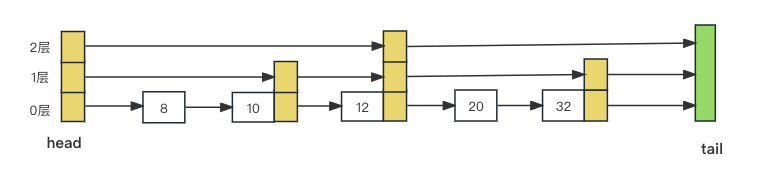

Go LeveDB是怎么实现SkipList的？

LeveDB的memTable一般用SkipList实现，快速回顾一下SkipList过程。



教材上的c++实现很简洁，大概的是这样定义的：

```c++
class Node {
  int val;
  int* links[];
}

class SkipList {
  int* head[];
  int* tail[];
}
```

比较关键的是插入结点value时，如何找到插入位置?

1. 首先确定结点要插入到哪一层。对于随机跳表，设插入到第h层，0 <= h <= MaxLevel；
2. 引入一个last数组，last[i] = x，i是第几层, x是节点，其中 0 <= i <= h，且 x.links[i].val >= value；

有了last数组，就可以找到在每一层上需要修改的节点指针。

有指针，好说，但如果要你不用指针(不用*这种方式)，只用数组(切片)来实现，你该怎么做？

Go的LevelDB(https://pkg.go.dev/github.com/syndtr/goleveldb/leveldb)实现，就是用一个切片来做的。


表示SkipList的DB结构体：

```go
type DB struct {
	cmp comparer.BasicComparer
	rnd *rand.Rand

	mu     sync.RWMutex
	kvData []byte
	// Node data:
	// [0]         : KV offset
	// [1]         : Key length
	// [2]         : Value length
	// [3]         : Height
	// [3..height] : Next nodes
	nodeData  []int
  prevNode  [tMaxHeight]int // tMaxHeight: 12
	maxHeight int
	n         int
	kvSize    int
}
```

 kvData用来放key value，nodeData用来放层级信息，像这样的格式：

```javascript
nodeData:
-------------------------------------------------
| kvOffset | kLen | vLen | h | h0 | ... | hn |
-------------------------------------------------
这样就代表一个node，node的数据放在kvData里，顺序写入kvData，位置用kvOffSet标识；
node的层级h，表示node有多少层，假设 h = 5，则表明node有5层；
h0：第0层指向哪个结点，存的nodeData中的下标，相当于node.links[0]；
h4：第4层指向哪个结点；
h是多少，就有多少个层。有个例外是头结点，一开始空的SkipList表示是：

初始的nodeData:
--------------------------------------------------------------------------
| 0(kvOffset) | 0(kLen) | 0(vLen) | h(12) | h0(0) | h1(0) | ... | h11(0) |
--------------------------------------------------------------------------
头结点12层。
```

prevNode就相当于last数组，语义也是一样的，用来存 node.links[i] >= value。


