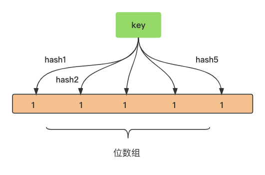

# BloomFilter

## 原理



key经过一系列hash函数，映射到位数组上某一个位，设为1。

判断key是否存在：经过一系列hash函数，对应位数组上如果有一个0，则说明一定不存在，都是1，可能存在，也可能不存在。


## 结构

```go
type bloomFilterGenerator struct {
	n int		// 每一个key占用的位数, 取10
	k uint8 // hash函数个数, 取6

	keyHashes []uint32
}
```


## InternalKey

key在MemTable里叫InternalKey：

```go
type internalKey []byte
```

结构是像这样：

```javascript
==================================
| key内容 | 8字节 (seq << 8 | kt) |
==================================
```

<br />

## Hash

在MemTable转成SSTable时，遍历MemTable的key，首先取一下key的hash，取hash的方式：

```go
已知: seed = uint32(0xbc9f1d34), m = uint32(0xc6a4a793)

设, key = [ x0,x1,x2,x3, x4,x5,x6,x7, ..., r0, r1, r2 ],
则，keyLen = uint32(len(key)) // 字节长度

进行下列运算：
h = seed ^ (keyLen * m)

keyLen/4
----------
--            h = h + LittleEndian.Uint32(key[i:]) // 小端
--            h = h * m
--            h = h ^ (h >> 16)
----------
start: i=0
step:  4

余下r0, r1, r2三个字节, 一样要小端
R = (r2 << 16) + (r1 << 8) + r0)
h = h + R
h = h * m
h = h ^ (h >> 24)

得到最终 h.
```

<br />                                                 

## Generate

有了key的hash，就可以设置位数组了。

```go
goleveldb取的位数组大小与key的数量有关,
位数nBits = key的数量 * 10(n的值)，再对齐到8,
位数组dest = new Array(nBits),

之后, 对每个key的hash, 做如下运算:
delta = (keyhash >> 17) | (keyhash << 15) // 高15位到后, 低17位到前

6(k的值)
----------
--            bitpos = keyhash % nBits // 取模, 得到在位数组的位置
--            dest[bitpos] = 1 // 该位设为1
--            keyhash = keyhash + delta
----------
start: i=0
step:  1
```

能看出，leveldb用的增量式hash，6次循环得到6个位置。