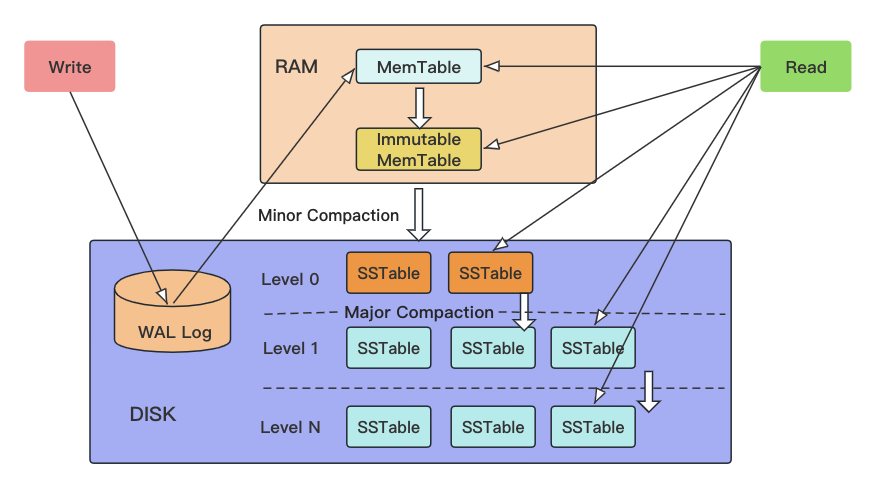

# Go的LeveDB实现

go version go1.20.3 darwin/amd64


Installation
-----------

```shell
go get github.com/syndtr/goleveldb/leveldb
```


# 架构



Write：先顺序写log，再写内存，写入很快。MemTable到达一定容量后（4MiB），冻结当前MemTable，变成Immutable MemTable，重新开一个新的空白MemTable，之后把Immutable写入磁盘，作为0层SSTable，内存刷到磁盘的操作叫minor compaction。

Read：扩散读，先内存、再磁盘。为提升读性能，引入了LRU缓存，还有各个SSTable里的BloomFilter。


# 局部

1. [MemTable的实现](./01_memtable.md)
2. [BloomFilter的实现](./02_bloomfilter.md)


# 螺旋式认知

以前看源码，喜欢把每一个类有哪些字段，类与类之间的关联都画出来，再去看数据流向。

这种方式细节无敌，但繁琐，且大部分时候用类图根本描述不了整个过程，很苦恼。

后来慢慢地尝试：先在更高一层抽象理解代码意图（这步大部分是通过看注释，或者直接Google搜别人的文章），再潜入某个点，用局部的类图辅助，窥探实现细节，用符号化的语言去描述代码意图。经过这样的方式，比之前画类图联系的方式快很多。

当分散理解了一个项目的各个核心功能后，就可以尝试把局部联系起来，联系的方式是通过项目的测试用例代码(比如Go就是很多的_test.go文件）。一般一个好的项目都有完整的测试用例，通过这些用例就可以把各个部分融会贯通。


